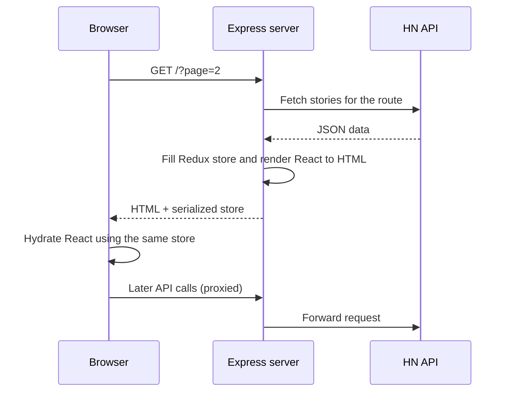

# Hacker News SSR - React Server-Side Rendering from Scratch


A Hacker News client with **server-side rendering built by hand**: no Next.js and no SSR framework. Pages are rendered to HTML on an Express server, sent to the browser, then hydrated by React so they become fully interactive.

It's meant as a clear, working reference for how SSR actually works under the hood, and it can serve as a starter for larger apps.

---

## ✨ Features

- **Custom SSR pipeline**: Express renders React with `StaticRouter`, and the browser hydrates with `BrowserRouter`
- **Server-to-client state hydration**: a Redux store is filled on the server, serialized into the page and reused as the client's initial state
- **XSS-safe state serialization** with `serialize-javascript`
- **Code splitting** with `react-loadable`
- **SEO**: per-route meta tags with `react-helmet`
- **API proxying**: `express-http-proxy` sends browser API calls through the host server, so client and server use the same API layer
- **Upvote and hide** actions on stories (API mocked, actions ready to wire to a real backend)
- **Bookmarkable pagination**: Prev and Next links map to shareable URLs
- **Mobile-first**, semantic markup
- **Unit tests** with Jest and Enzyme covering props, rendering and click events

---

## 🏗️ How it works



### Build setup

- Two Webpack configs (`webpack.client.js` and `webpack.server.js`) share a common `webpack.base.js`
- Babel transpiles modern JavaScript for the last two browser versions
- `npm-run-all` runs the server build, client build and Nodemon in parallel during development

---

## 🚀 Getting started

```bash
npm install

# development server on http://localhost:3000
npm run dev

# tests with coverage
npm run test

# production start
npm start
```

---

## 🛠️ Tech stack

React · Redux · Redux Thunk · Immutable.js · React Router (`react-router-config`) · Express · express-http-proxy · Webpack · Babel · react-helmet · react-loadable · serialize-javascript · React Bootstrap · Jest · Enzyme · Nodemon

---

## 👤 Author

**Mustkeem K**, Senior Full Stack Engineer · [mustkeemk.com](https://mustkeemk.com) · [LinkedIn](https://linkedin.com/in/mustkeemk)
